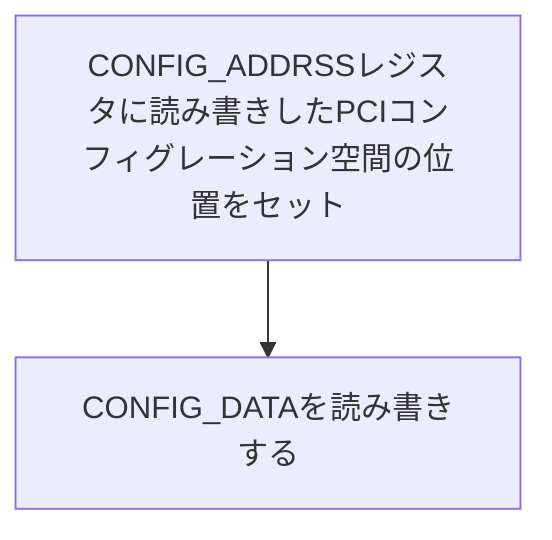

day06a 
# USBドライバについて
USBとソフトウェア(OS)の橋渡しをするのが、USBホストコントローラである。これは、USBを制御するためのチップが搭載されている。
OSは、このコントローラを制御することにより、USB本体と通信することができる。
ハードウェアを扱うためのソフトウェアをドライバという。

USB関連のドライバには、USB機器に搭載するターゲットドライバと、PC側のホストドライバに分かれる。
OSづくりでは、ホストドライバ側を記述する。

今回ホストドライバは、以下の様に３層に分ける。
1. ホストコントローラドライバ
   ホストコントローラを制御する。
2. USBバスドライバ
    ホストコントローラの内容を隠して、USB規格に沿ったAPIを提供する
3. クラスドライバ
   USBターゲットの種類ごとに用意するクラスドライバ

# PCIデバイスの探索
以下の順で、探す。
1. PCIバスに接続されたデバイスを列挙
2. 列挙されたデバイスの一覧からxHC(USB 3.0)を探す
3. USBバス上でマウスを探す
4. マウスを初期化して、データを受信

PCI(Peripheral Component INterconnect)とは部品とマザーボードを繋ぐための規格。
xHCの他にも,NVMe SSD, 高精度タイマ、ネットワークカード、GPUなどがPCIeにより接続される。

※: Non-Volatile Memory Express

1. PCIバスに接続された機器の探索
PCI規格に準拠した機器は、それぞれ256バイトのPCIコンフィグレーション空間を持っている。
PCIデバイスのベンダIDやクラスコード(PCIデバイスの種類を表す数値)などの情報が書かれている。
探索では、それぞれのPCIデバイスのコンフィグレーション空間を順に読み、調べていく作業。

コンフィグレーション空間は、256バイト(0x00~0xff)あり、先頭の0x40バイトはどのPCIデバイスでも共通。

どの様にして、メモリ上にロードするか？
CONFIG_ADDRESSレジストとCONFIG_DATAレジスタを使う。それぞれのIOアドレス空間の0x0cf8と0x0cfcにある32ビットのレジスタである。
まず、CONFIG_ADDRESSレジスタに読み書きしたPCIコンフィグレーション空間の位置を設定する。
例えば、Vendor IDを読み取りたい場合は、0x00と0x01に書かれている16ビットのあたいである。
CONFIG_ADDRESSをこの値に設定してから、CONFIG_DATAの中の値を読み取ることにより可能。

CONFIG_ADDRESSレジスタの構造  

| ビット位置 |                                           内容                                           |
| :--------: | :--------------------------------------------------------------------------------------: |
|     31     | Enableビット。１にすると、CONFIG_DATAの読み書きがPCIコンフィグレーション空間に転送される |
|   30:24    |                                  予約領域。０にしておく                                  |
|   23:16    |                                    バス番号(0 - 255)                                     |
|   15:11    |                                    デバイス番号(0-31)                                    |
|    10:8    |                                 ファンクション番号(0-7)                                  |
|    7:0     |              レジスタオフセット(0-255) 4バイト単位のオフセットを指定する。               |

PCIバスは複数あり、1つのバスについて最大32このPCIデバイスが接続される。
1つのPCIデバイスは最大8つまでのファンクションを持つことができる。
デバイスは必ずファンクショ0を持つ。
Enableビットを1にした状態でCONFIG_DATAレジスタを読み書きすることで任意のレジスタを読み書きすることができる。各種の番号からCONFIG_ADDRESSレジスタに書き込むために32人値を生成する関数を定義する。
PCIコンフィグレーションの位置は、7:0のビット位置で設定する。

IO ポートを読み書きするアセンブラ関数を作成する。
IO アドレス空間はメモリアドレス空間とは完全に別のアドレス空間。
メインアドレス空間は、メインメモリ用、IOアドレス空間は周辺機器用。
IOアドレス空間の読み書きには専門のIO命令(in と out)を使う必要がある。

この部分だけあアセンブリ言語で書き、それをC++から呼び出して使う。
引数addrはRDIレジスタに、dataはRSIレジスタに設定された状態で関数の処理が始まる。
`out dx, eax`は、IOポートアドレスに対して、(EAX)に設定された32ビット整数を出力する。

raxレジスタに設定した値がそのまま戻り値になる。

バス0, デバイス0,
ファンクション0のPCIコンフィグレーション空間からヘッダタイプを読み取っている。
これは、ホストブリッジ。ホストブリッジは、ホスト側とPCIバス側を橋渡しする部品で、CPUとPCIデバイス間の通信はここを通過する。
ビット7が1の場合は、マルチファンクションデバイス。
=> ファンクション0以外にも機能を持っているPCIデバイスを意味する。

ファンクション0のホストブリッジがマルチファンクションデバイスではない場合は、そのホストブリッジはバス0を担当するホストブリッジ。
=> バス0で、デバイス番号(0-31)を担当するホストブリッジ
マルチファンクションデバイスの場合、ホストブリッジが複数存在することを意味する。
=> ファンクション0がバス0, func=1がバス1を担当...

各バスの探索は、ScanBus()が担当する。

PCIのバス、デバイス、ファンクションについての参考URL: https://qiita.com/KenjiOtsuka/items/34c0476307103b21f6c7